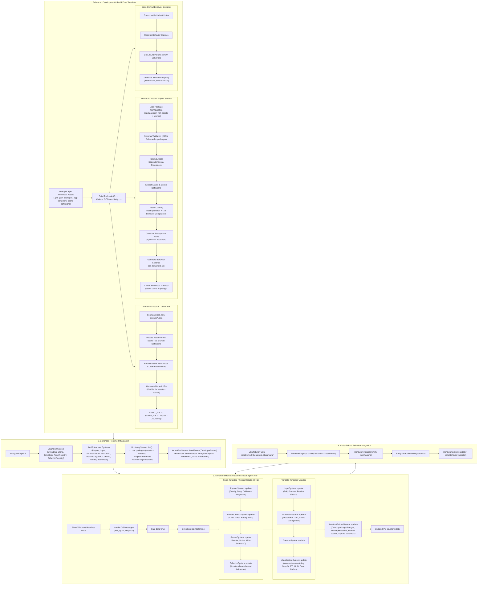

# Enhanced Package Modularity Flowchart

## Enhanced Architecture Flow Description

### Phase 1: Enhanced Development & Build-Time Toolchain

**Enhanced Asset Compiler Service:**
- Processes hierarchical package.json files containing both assets and scenes
- Validates schema for the new package structure
- Resolves asset references within scene definitions
- Compiles behaviors and links them to entities
- Generates optimized binary packs with asset-scene mappings

**Code-Behind Behavior Compiler:**
- Scans JSON for `codeBehind` attributes
- Registers C++ behavior classes in runtime registry
- Links JSON parameters to C++ behavior constructors
- Generates behavior factory for runtime instantiation

### Phase 2: Enhanced Runtime Initialization

**Enhanced Systems:**
- **BehaviorSystem**: Manages all code-behind behaviors attached to entities
- **Enhanced WorldGenSystem**: Loads scenes from package definitions with asset references
- **Enhanced EntityFactory**: Creates entities with behaviors from JSON definitions

**Package Loading:**
- Loads hierarchical package structure (assets + scenes)
- Validates asset dependencies
- Registers behaviors in runtime registry
- Creates asset-scene mappings for efficient lookup

### Phase 3: Enhanced Main Simulation Loop

**Code-Behind Integration:**
- BehaviorSystem updates all attached behaviors during fixed timestep
- Behaviors receive entity reference and deltaTime for updates
- Asset-driven rendering uses references instead of hardcoded resources
- Hot-reload system monitors package changes and updates behaviors

### Phase 4: Code-Behind Behavior Flow

**Runtime Behavior Attachment:**
1. JSON entity specifies `codeBehind="behaviors.ClassName"`
2. BehaviorRegistry creates instance of specified class
3. Behavior initializes with entity reference and JSON parameters
4. Entity receives attached behavior for lifecycle management
5. BehaviorSystem calls update() on all behaviors each frame

This enhanced flow enables declarative scene authoring with high-performance C++ behaviors while maintaining hot-reload capabilities for rapid development iteration.

  MAIN --> ENG --> SYS --> BOOT --> LOAD
end

%% =============================
%% 3. MAIN SIMULATION LOOP
%% =============================

subgraph LOOP["3. Main Simulation Loop (Engine::run)"]
  START["Show Window / Headless Mode"]

  OSMSG["Handle OS Messages\n(WM_QUIT, Dispatch)"]
  DELTA["Calc deltaTime"]
  CLOCK["SimClock::tick(deltaTime)"]

  subgraph PHYS["Fixed-Timestep Physics Update (60Hz)"]
    PHYSYS["PhysicsSystem::update\n(Gravity, Drag, Collisions, Integration)"]
    VEH["VehicleControlSystem::update\n(CPU, Mixer, Battery limits)"]
    SENS["SensorSystem::update\n(Sample, Noise, Write SensorsC)"]

    PHYSYS --> VEH --> SENS
  end

  subgraph VARSYS["Variable-Timestep Updates"]
    INPUT["InputSystem::update\n(Poll, Process, Publish Events)"]
    WGEN["WorldGenSystem::update\n(Procedural, LOD, Voxel Clouds)"]
    CON["ConsoleSystem::update"]
    REND["VisualizationSystem::update\n(OpenGL/ES, HUD, Swap Buffers)"]

    INPUT --> WGEN --> CON --> REND
  end

  HOT["AssetHotReloadSystem::update\n(Detect changes, Recompile, Swap Registry, dlopen)"]
  FPS["Update FPS counter / stats"]

  START --> OSMSG --> DELTA --> CLOCK --> PHYS --> VARSYS --> HOT --> FPS
end

%% =============================
%% Final Flow
%% =============================

DEV --> INIT --> LOOP
